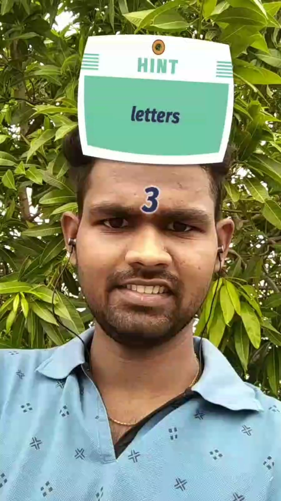

<h1>Welcome to Guess the Location AR Game 👋</h1>

  
  
  

#### AR Game Built on Spark AR to deploy on Instagram as Filter
Each Instance a Random Clue will be popped up and User need to Guess the Location based on it.

After 5 seconds of countdown Answer will be Displayed.

All screens are trcacked on the User Face Co-ordinates as Face Tracking is Enabled.

### ✨ [Try the filter on Instagram](https://www.instagram.com/ar/787048095161541/)

### 🏠 [Check out the Cluesheet Here](https://nitishgadangi.github.io/QR_Hunt/)

### 📱 [Checkout Android App Version of This Game](https://github.com/NitishGadangi/QR_Hunt)

## Screenshots
<table>
    <tr>
     <td><kbd></kbd></td>
     <td><kbd></kbd></td>
     <td><kbd></kbd></td>
    </tr>
</table>

## Patch Editor
Here is an blockview of Filter Backend Code

## How to Edit Files

* Download [Spark Ar Studio](https://sparkar.facebook.com/ar-studio/) and Open .arproj files
* Use PSD's available in RAW_RESOURCES folder as templetes to generate Questions and Answers based on your requirements
* Replace corresponding files in Spark AR project to make your own filter
* Make changes to patch editors if required

## Show your support

Give a ⭐️ if this project helped you!

 **Made with ❤ Nitish Gadangi**
